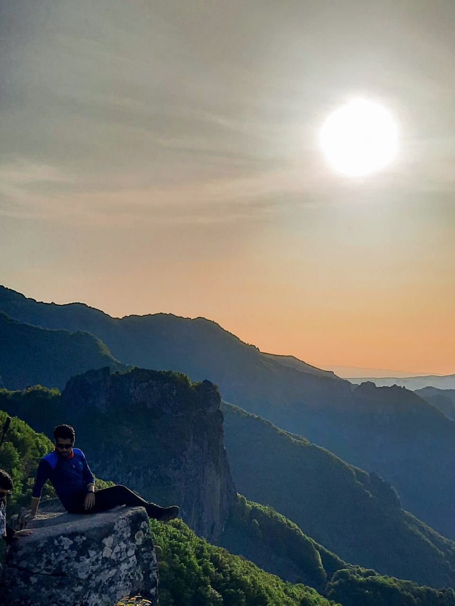
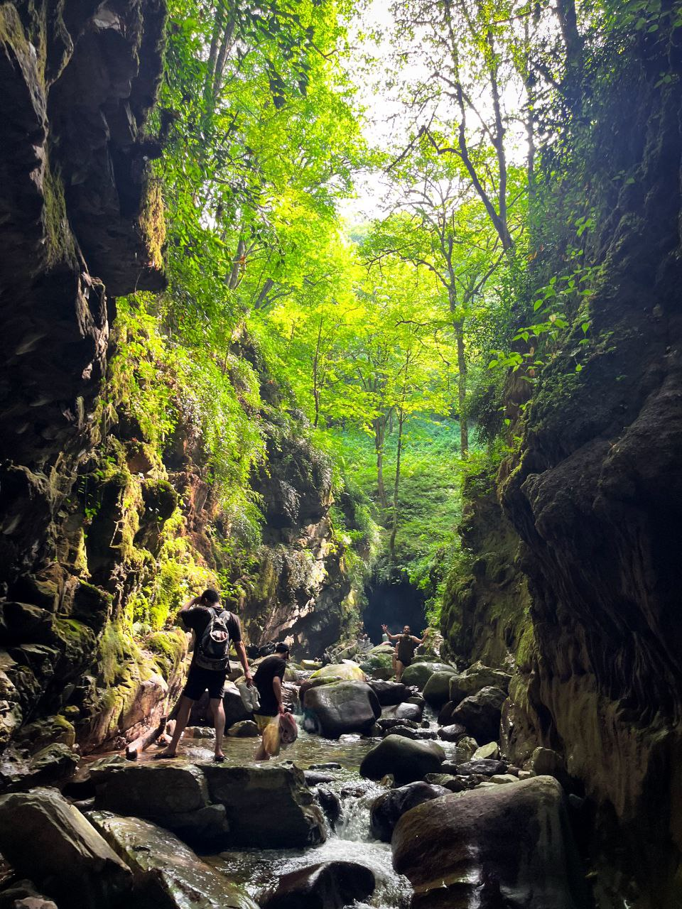
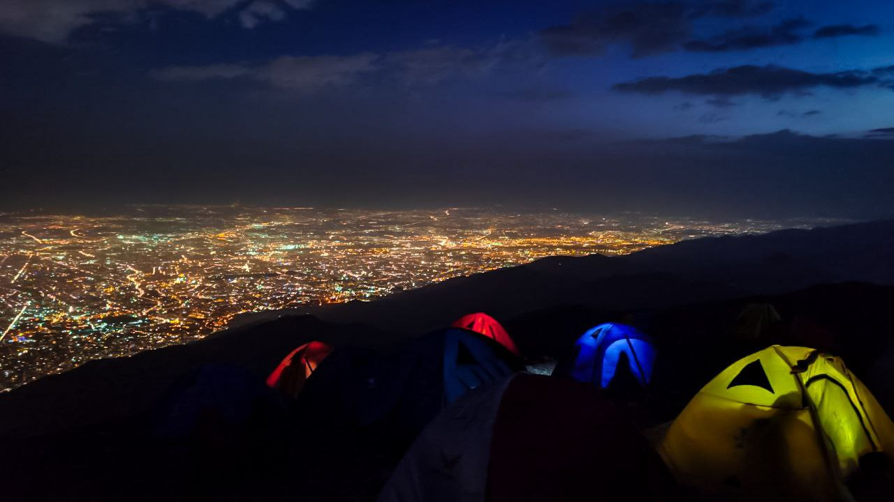
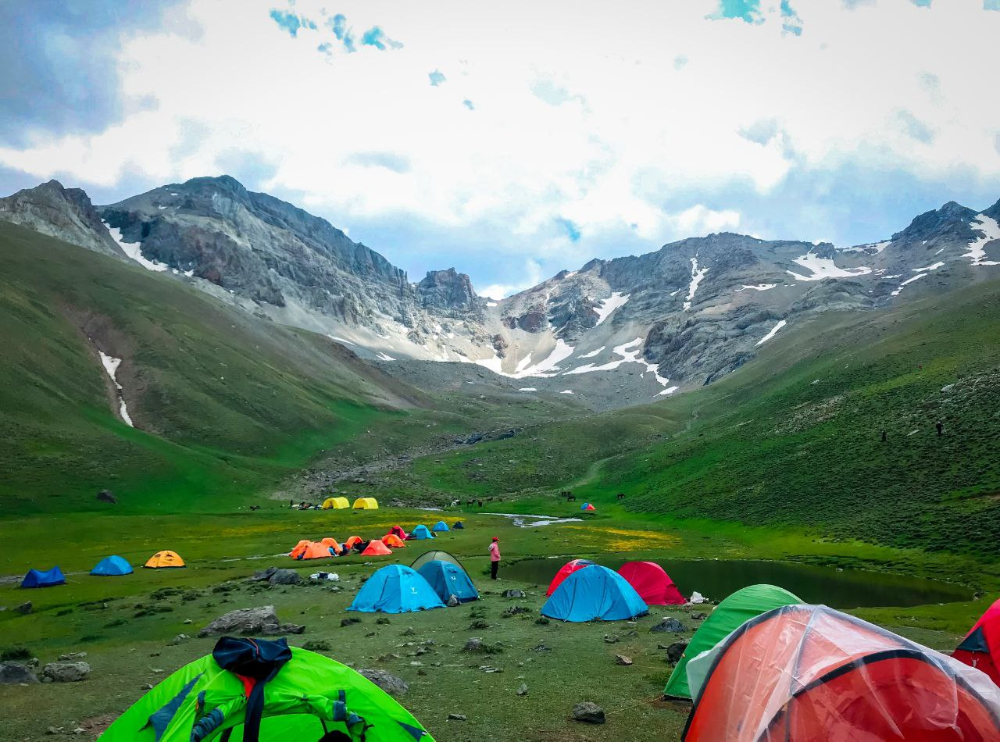
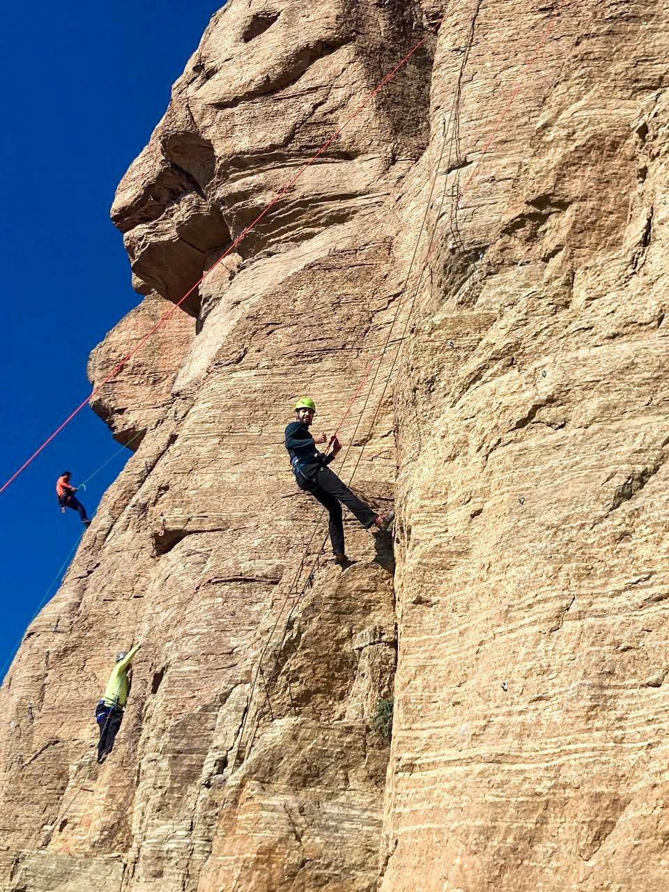
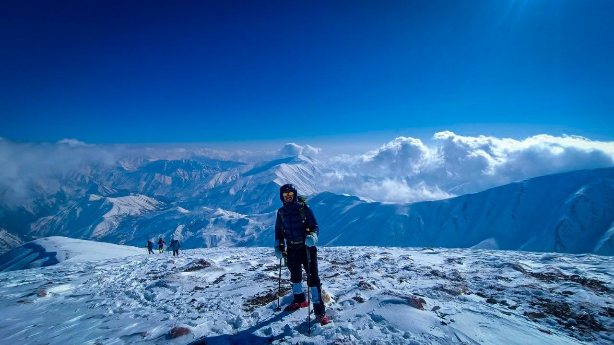

## Summary
Passionate and driven Electrical and Computer Engineer with a strong focus on leveraging artificial intelligence in drug discovery and protein engineering. Experienced in applying advanced AI techniques, including diffusion models, to bioinformatics for predicting and optimizing protein structures, skilled in developing innovative solutions to complex biological problems, with a commitment to advancing the field of AI-based protein engineering and bioinformatics.

##### Technical Skills: Diffusion Models, Generative Models, AI-based Protein Engineering, Protein design, Machine Learning, Deep Learning, Python, MATLAB

### Research interests 
AI-driven Drug Discovery, Protein Structure Prediction, Bio-informatics, Diffusion Models, AI-based Protein Engineering.

## Research Experience
### Diffusion models in Bio-informatics  @ [Prof. Chehreghani lab]
- Focused on AI-driven drug discovery by leveraging protein structure prediction and bioinformatics.
- Developed diffusion-based generative models to optimize antigen-specific antibodies.

### Network Research Intern  @ [Ario-tech company]
- Reading papers and searching for novel schemes of Simulating 
Real-World Scenarios.
- Testing Apps and Apps, developed on real
world data and assessing the results. 

## Education
- B.Sc., Electrical Engineering (Major) - Telecommunication Systems | Amirkabir University of Technology (_Jan 2020 — Dec 2024_)
- Minor in Computer Engineering - Artificial Intelligence | Amirkabir University of Technology
- High school, National Organization for Development of  distinguished Students (Dr. Moein) (_Sep 2017 — Jul 2020_) 

## Relate Projects
### AI-driven Drug Discovery and Protein Structure Prediction
Developed AI models using **Python** to predict protein structures and design antibodies targeting specific antigens. These models enhanced drug discovery efforts by automating the identification of potential therapeutic candidates and improving accuracy.
### Chat-bot
Created an attention-based chatbot that analyzed personal Telegram chat histories to understand and mimic the individual's communication style.
### Image denoising with graphical models 
Binary Image Denoising using Variational Inference Implemented a binary image denoising algorithm using mean-field variational inference on an Ising model. This project involved reconstructing noisy binary images by approximating complex probability distributions, showcasing the effectiveness of Bayesian inference for image processing tasks.

## RELEVANT CERTIFICATES
Machine Learning - Stanford Online 

Deep Learning Specialization - DeepLearning.AI 

Fine-tuning LLM for specific tasks - DeepLearning.AI

Databases and MySQL for Data Science - Coursera

## Skills
Ability to Work in a Team,          Leadership,
Ability to Work under Pressure,  Analytical Skills, 
Communication Skills

## Extra-curriculum activities 
### hiking
Mountain climbing and rock climbing are my main weekend hobbies which I rarely skip. I was able to stand on the first, second, and third highest peaks of Iran, namely Damavand(5610m), Alam-Kuh(4860m), and Sabalan(4810m)

### Exercising
I go to the gym 3 times a week as well as running twice a week.

