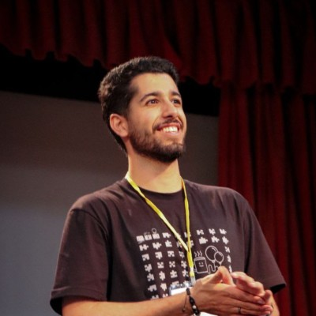

# Electrical and Computer Engineer

#### Technical Skills: Python, MATLAB, AI-based Protein Engineering, Machine Learning, Diffusion Models, Bioinformatics

## Education
- B.Sc., Electrical Engineering (Major) - Telecommunication Systems | Amirkabir University of Technology (_Expected: December 2024_)
- Minor in Computer Engineering - Artificial Intelligence | Amirkabir University of Technology

## Work Experience
**Network Research Intern @ [Research Institution Name] (_Dates TBD_)**
- Conducted research on simulating real-world scenarios by testing apps and analyzing results with a focus on Telecommunication Systems.
- Investigated novel approaches for simulating network scenarios to optimize performance.

**Research Assistant @ [Lab or Professor's Name] (_Dates TBD_)**
- Focused on AI-driven drug discovery by leveraging protein structure prediction and bioinformatics.
- Developed diffusion-based generative models to optimize antigen-specific antibodies.

## Projects
### AI-driven Drug Discovery and Protein Structure Prediction
Developed AI models using **Python** and **MATLAB** to predict protein structures and design antibodies targeting specific antigens. These models enhanced drug discovery efforts by automating the identification of potential therapeutic candidates and improving accuracy.

